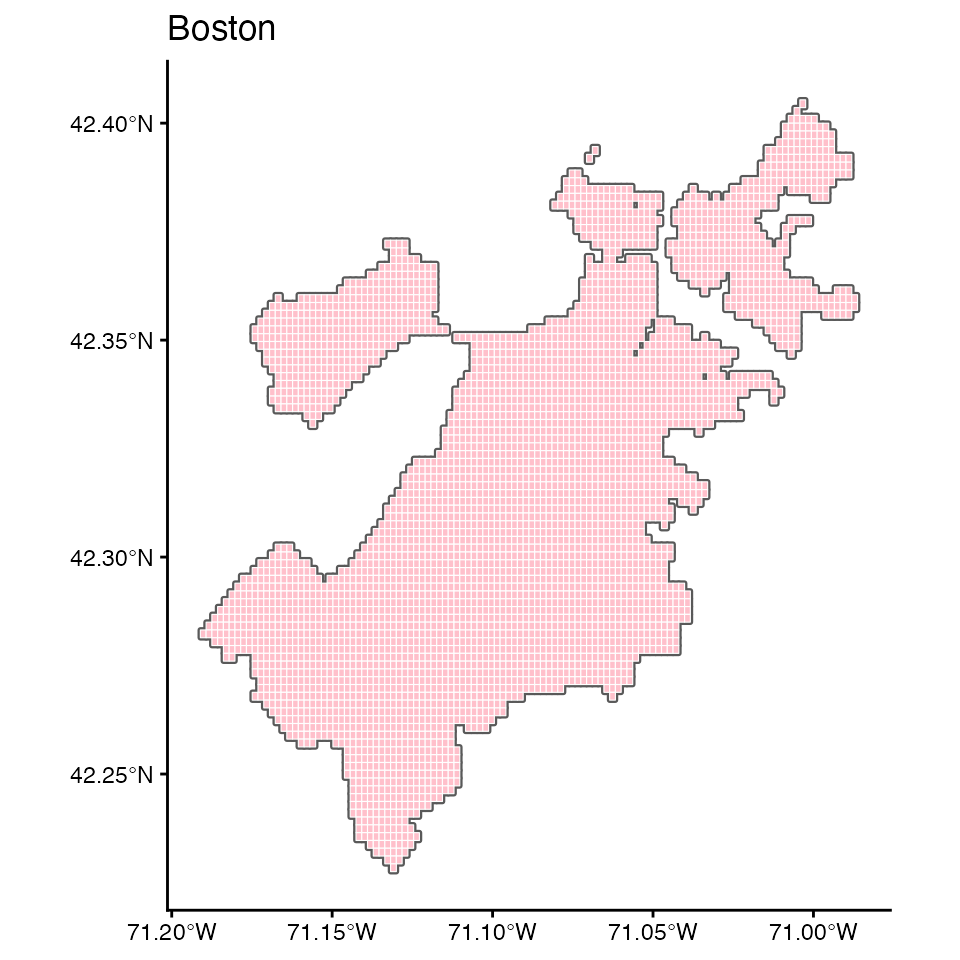
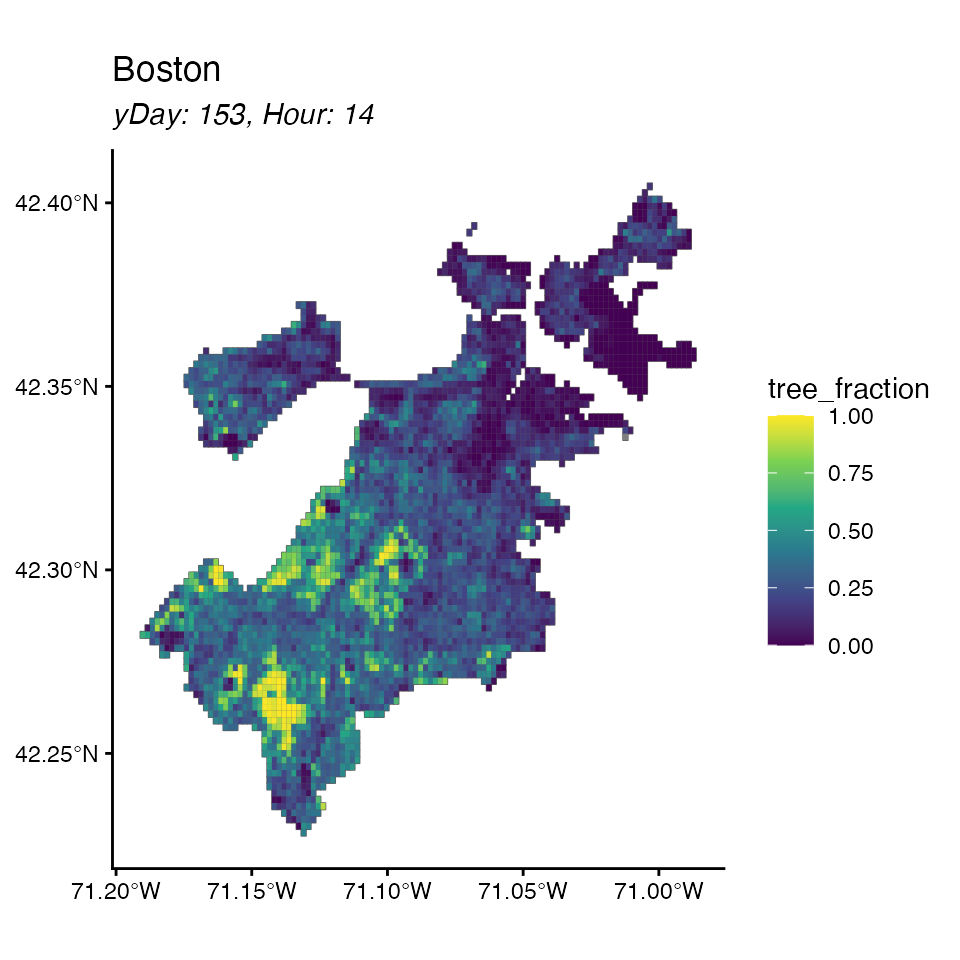
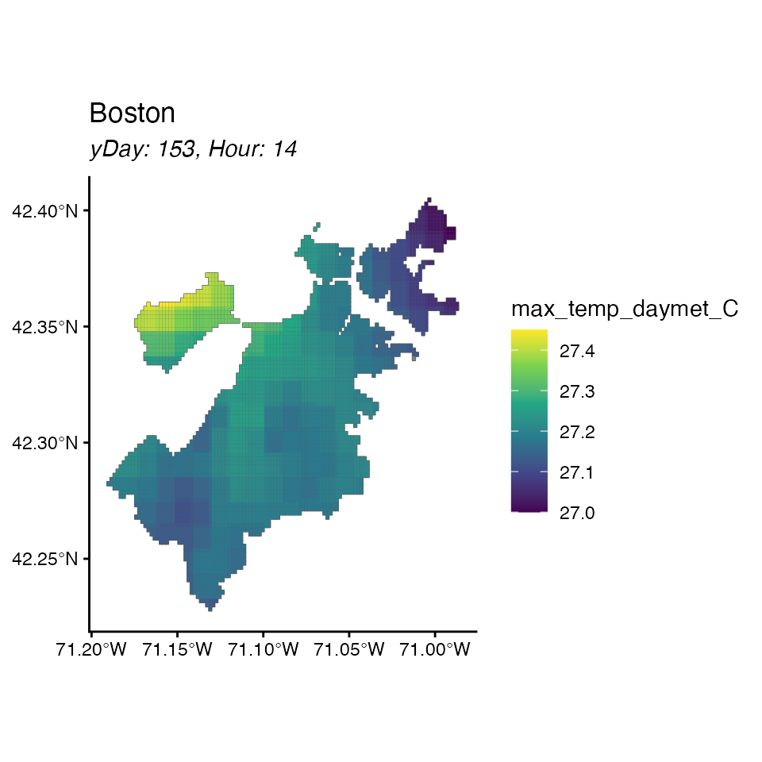
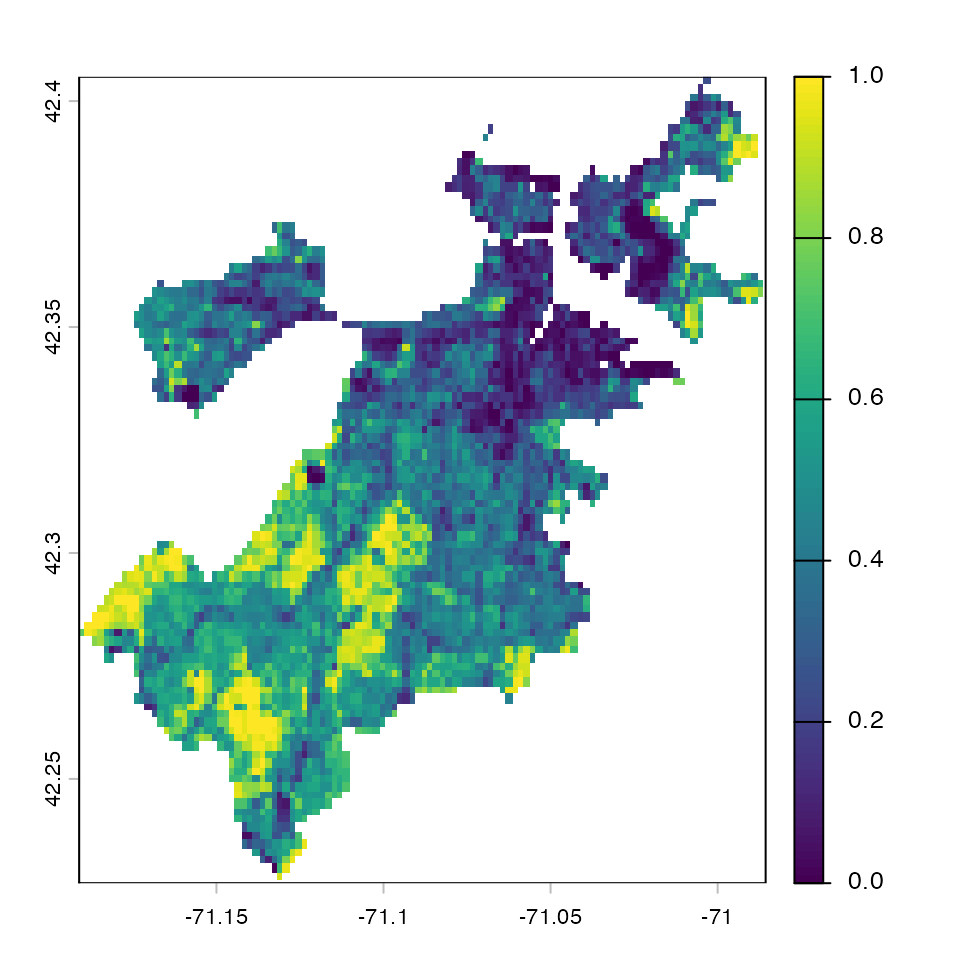
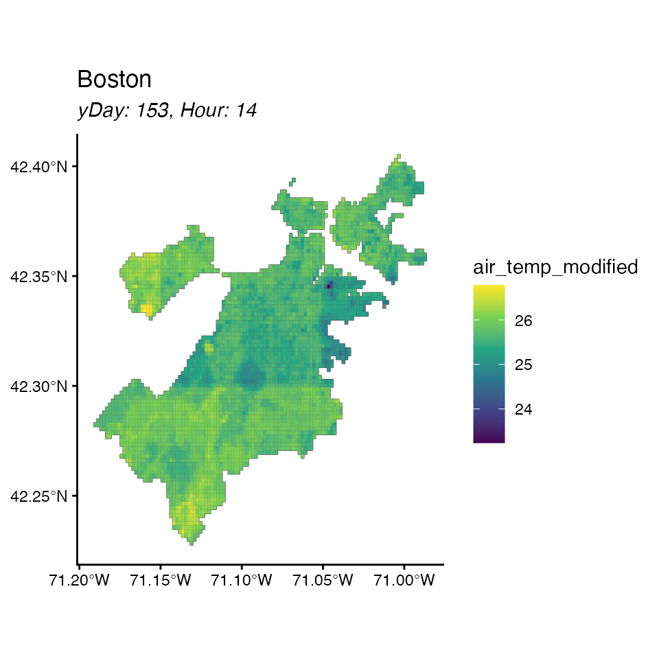
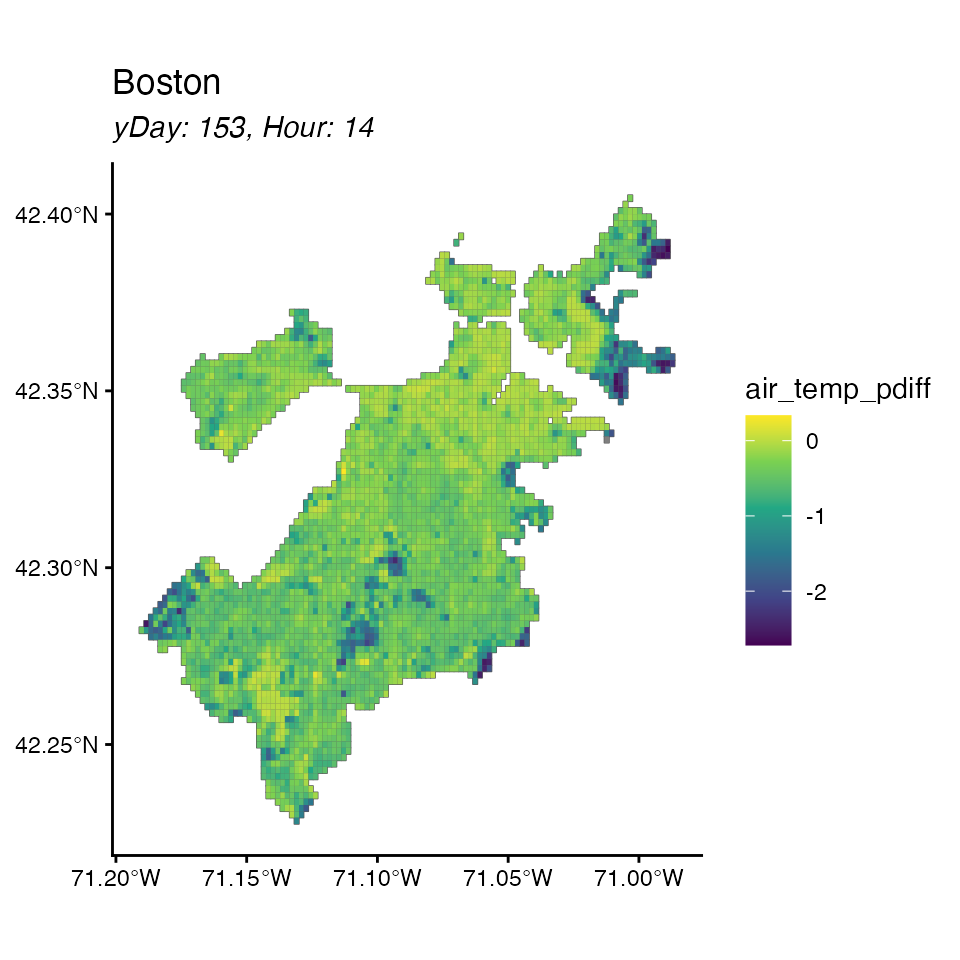

# Impacts of Boston Tree Cover Changes on Air Temperature

A package for the functions in [Smith
2025](https://doi.org/10.1038/s43247-025-02462-3). In this vignette, we
demonstrate how to use the package to investigate the impact of changes
in tree-cover on air temperature.

## Load the data

``` r

library(smithCEE2025)
#> Loading required package: sf
#> Linking to GEOS 3.13.0, GDAL 3.8.5, PROJ 9.5.1; sf_use_s2() is TRUE
#> Loading required package: data.table
#> Loading required package: ggplot2
#> Loading required package: terra
#> terra 1.8.86
#> 
#> Attaching package: 'terra'
#> The following object is masked from 'package:data.table':
#> 
#>     shift
#> Loading required package: raster
#> Loading required package: sp
#> Loading required package: exactextractr
```

Load the data

``` r

bos <- retrieve_output()
#>  city: boston
#>  ... load shapefile
#>  ... load data
#>  ... load coefficients
```

Look at the object

``` r

bos
#> <cityModel>
#>   city name:    boston 
#>   shapefile:    4219 grid cells; geometry: POLYGON 
#>   features:     1130424 rows x 16 cols
#>   coefficients: 9 
#>   (Intercept), tree_fraction, albedo, wind_m_s, wtr_dist_m, solar_w_m2, max_temp_daymet_C, hod, I(hod^2)
```

And look specifically at each part: the features

``` r

head(bos)
#> Key: <id>
#>       id   hod   doy  index max_temp_daymet_C minT_daymet wind_m_s solar_w_m2
#>    <num> <num> <num> <char>             <num>       <num>    <num>      <num>
#> 1:     1    14   153  1_153             27.02       11.36     2.85      714.2
#> 2:     1    14   154  1_154             24.26       14.46     4.66      440.6
#> 3:     1    14   155  1_155             26.47       17.02     3.12      370.2
#> 4:     1    14   156  1_156             32.25       15.34     6.39      891.9
#> 5:     1    14   157  1_157             33.90       18.19     4.80      896.0
#> 6:     1    14   158  1_158             34.60       20.08     6.29      331.6
#>    prev_day_max next_day_min   pop albedo albedo_new tree_fraction tree_new
#>           <num>        <num> <num>  <num>      <num>         <num>    <num>
#> 1:        24.17        14.46 46.87  0.136      0.136          0.14   24.941
#> 2:        27.02        17.02 46.87  0.136      0.136          0.14   24.941
#> 3:        24.26        15.34 46.87  0.136      0.136          0.14   24.941
#> 4:        26.47        18.19 46.87  0.136      0.136          0.14   24.941
#> 5:        32.25        20.08 46.87  0.136      0.136          0.14   24.941
#> 6:        33.90        22.08 46.87  0.136      0.136          0.14   24.941
#>    wtr_dist_m
#>         <num>
#> 1:    987.084
#> 2:    987.084
#> 3:    987.084
#> 4:    987.084
#> 5:    987.084
#> 6:    987.084
```

the shapefile

``` r

head(bos$shapefile)
#> Simple feature collection with 6 features and 1 field
#> Geometry type: POLYGON
#> Dimension:     XY
#> Bounding box:  xmin: -71.00782 ymin: 42.39999 xmax: -71.00064 ymax: 42.40538
#> Geodetic CRS:  WGS 84
#>   id                       geometry
#> 1  1 POLYGON ((-71.00423 42.4053...
#> 2  2 POLYGON ((-71.00603 42.4035...
#> 3  3 POLYGON ((-71.00782 42.4017...
#> 4  4 POLYGON ((-71.00603 42.4017...
#> 5  5 POLYGON ((-71.00423 42.4017...
#> 6  6 POLYGON ((-71.00243 42.4017...
```

and the coefficients.

``` r

print(bos$coefficients)
#>       (Intercept)     tree_fraction            albedo          wind_m_s 
#>     -3.323218e+01     -7.086473e-01     -3.858735e+00     -6.789460e-02 
#>        wtr_dist_m        solar_w_m2 max_temp_daymet_C               hod 
#>      2.064495e-06      3.694630e-03      9.820124e-01      3.909074e+00 
#>          I(hod^2) 
#>     -1.201507e-01
```

You can plot several ways: just by cell id

``` r

plot(bos)
#> No feature selected, plotting cell id
```



Or by a specific feature

``` r

plot(bos, feature = 'tree_fraction')
```



And you can zoom in on a specific day

``` r

plot(bos, feature = 'max_temp_daymet_C', hod = 14, doy = 153)
```



## Load a raster file and make changes

First convert your .tif to a raster object. Note in this example we’ve
already clipped it to the Boston extent, but the code doesn’t assume
that it is clipped.

``` r

image_path <- system.file("extdata", 
                          "treeCanopy_sample.tif", 
                          package = "smithCEE2025")
tree_raster <- rast(image_path)
```

Tree canopy in particular should be represented as a proportion and not
percent for consistency with data used in model fit

``` r

plot(tree_raster)
```


``` r


tree_raster <- tree_raster/100
plot(tree_raster)
```



Now, pass this in and see the difference it makes for air temperature.
this will add `air_temp_baseline` and `air_temp_modified` as a result of
the changes that were made.

``` r

new_bos <- what_if(bos, 'tree_fraction', tree_raster)
#>  ... validation
#>  ... extract raster
#> Warning in what_if(bos, "tree_fraction", tree_raster): some NA raster cells are
#> NA
#>   |                                                                              |                                                                      |   0%  |                                                                              |                                                                      |   1%  |                                                                              |=                                                                     |   1%  |                                                                              |=                                                                     |   2%  |                                                                              |==                                                                    |   2%  |                                                                              |==                                                                    |   3%  |                                                                              |==                                                                    |   4%  |                                                                              |===                                                                   |   4%  |                                                                              |===                                                                   |   5%  |                                                                              |====                                                                  |   5%  |                                                                              |====                                                                  |   6%  |                                                                              |=====                                                                 |   6%  |                                                                              |=====                                                                 |   7%  |                                                                              |=====                                                                 |   8%  |                                                                              |======                                                                |   8%  |                                                                              |======                                                                |   9%  |                                                                              |=======                                                               |   9%  |                                                                              |=======                                                               |  10%  |                                                                              |=======                                                               |  11%  |                                                                              |========                                                              |  11%  |                                                                              |========                                                              |  12%  |                                                                              |=========                                                             |  12%  |                                                                              |=========                                                             |  13%  |                                                                              |=========                                                             |  14%  |                                                                              |==========                                                            |  14%  |                                                                              |==========                                                            |  15%  |                                                                              |===========                                                           |  15%  |                                                                              |===========                                                           |  16%  |                                                                              |============                                                          |  16%  |                                                                              |============                                                          |  17%  |                                                                              |============                                                          |  18%  |                                                                              |=============                                                         |  18%  |                                                                              |=============                                                         |  19%  |                                                                              |==============                                                        |  19%  |                                                                              |==============                                                        |  20%  |                                                                              |==============                                                        |  21%  |                                                                              |===============                                                       |  21%  |                                                                              |===============                                                       |  22%  |                                                                              |================                                                      |  22%  |                                                                              |================                                                      |  23%  |                                                                              |================                                                      |  24%  |                                                                              |=================                                                     |  24%  |                                                                              |=================                                                     |  25%  |                                                                              |==================                                                    |  25%  |                                                                              |==================                                                    |  26%  |                                                                              |===================                                                   |  26%  |                                                                              |===================                                                   |  27%  |                                                                              |===================                                                   |  28%  |                                                                              |====================                                                  |  28%  |                                                                              |====================                                                  |  29%  |                                                                              |=====================                                                 |  29%  |                                                                              |=====================                                                 |  30%  |                                                                              |=====================                                                 |  31%  |                                                                              |======================                                                |  31%  |                                                                              |======================                                                |  32%  |                                                                              |=======================                                               |  32%  |                                                                              |=======================                                               |  33%  |                                                                              |=======================                                               |  34%  |                                                                              |========================                                              |  34%  |                                                                              |========================                                              |  35%  |                                                                              |=========================                                             |  35%  |                                                                              |=========================                                             |  36%  |                                                                              |==========================                                            |  36%  |                                                                              |==========================                                            |  37%  |                                                                              |==========================                                            |  38%  |                                                                              |===========================                                           |  38%  |                                                                              |===========================                                           |  39%  |                                                                              |============================                                          |  39%  |                                                                              |============================                                          |  40%  |                                                                              |============================                                          |  41%  |                                                                              |=============================                                         |  41%  |                                                                              |=============================                                         |  42%  |                                                                              |==============================                                        |  42%  |                                                                              |==============================                                        |  43%  |                                                                              |==============================                                        |  44%  |                                                                              |===============================                                       |  44%  |                                                                              |===============================                                       |  45%  |                                                                              |================================                                      |  45%  |                                                                              |================================                                      |  46%  |                                                                              |=================================                                     |  46%  |                                                                              |=================================                                     |  47%  |                                                                              |=================================                                     |  48%  |                                                                              |==================================                                    |  48%  |                                                                              |==================================                                    |  49%  |                                                                              |===================================                                   |  49%  |                                                                              |===================================                                   |  50%  |                                                                              |===================================                                   |  51%  |                                                                              |====================================                                  |  51%  |                                                                              |====================================                                  |  52%  |                                                                              |=====================================                                 |  52%  |                                                                              |=====================================                                 |  53%  |                                                                              |=====================================                                 |  54%  |                                                                              |======================================                                |  54%  |                                                                              |======================================                                |  55%  |                                                                              |=======================================                               |  55%  |                                                                              |=======================================                               |  56%  |                                                                              |========================================                              |  56%  |                                                                              |========================================                              |  57%  |                                                                              |========================================                              |  58%  |                                                                              |=========================================                             |  58%  |                                                                              |=========================================                             |  59%  |                                                                              |==========================================                            |  59%  |                                                                              |==========================================                            |  60%  |                                                                              |==========================================                            |  61%  |                                                                              |===========================================                           |  61%  |                                                                              |===========================================                           |  62%  |                                                                              |============================================                          |  62%  |                                                                              |============================================                          |  63%  |                                                                              |============================================                          |  64%  |                                                                              |=============================================                         |  64%  |                                                                              |=============================================                         |  65%  |                                                                              |==============================================                        |  65%  |                                                                              |==============================================                        |  66%  |                                                                              |===============================================                       |  66%  |                                                                              |===============================================                       |  67%  |                                                                              |===============================================                       |  68%  |                                                                              |================================================                      |  68%  |                                                                              |================================================                      |  69%  |                                                                              |=================================================                     |  69%  |                                                                              |=================================================                     |  70%  |                                                                              |=================================================                     |  71%  |                                                                              |==================================================                    |  71%  |                                                                              |==================================================                    |  72%  |                                                                              |===================================================                   |  72%  |                                                                              |===================================================                   |  73%  |                                                                              |===================================================                   |  74%  |                                                                              |====================================================                  |  74%  |                                                                              |====================================================                  |  75%  |                                                                              |=====================================================                 |  75%  |                                                                              |=====================================================                 |  76%  |                                                                              |======================================================                |  76%  |                                                                              |======================================================                |  77%  |                                                                              |======================================================                |  78%  |                                                                              |=======================================================               |  78%  |                                                                              |=======================================================               |  79%  |                                                                              |========================================================              |  79%  |                                                                              |========================================================              |  80%  |                                                                              |========================================================              |  81%  |                                                                              |=========================================================             |  81%  |                                                                              |=========================================================             |  82%  |                                                                              |==========================================================            |  82%  |                                                                              |==========================================================            |  83%  |                                                                              |==========================================================            |  84%  |                                                                              |===========================================================           |  84%  |                                                                              |===========================================================           |  85%  |                                                                              |============================================================          |  85%  |                                                                              |============================================================          |  86%  |                                                                              |=============================================================         |  86%  |                                                                              |=============================================================         |  87%  |                                                                              |=============================================================         |  88%  |                                                                              |==============================================================        |  88%  |                                                                              |==============================================================        |  89%  |                                                                              |===============================================================       |  89%  |                                                                              |===============================================================       |  90%  |                                                                              |===============================================================       |  91%  |                                                                              |================================================================      |  91%  |                                                                              |================================================================      |  92%  |                                                                              |=================================================================     |  92%  |                                                                              |=================================================================     |  93%  |                                                                              |=================================================================     |  94%  |                                                                              |==================================================================    |  94%  |                                                                              |==================================================================    |  95%  |                                                                              |===================================================================   |  95%  |                                                                              |===================================================================   |  96%  |                                                                              |====================================================================  |  96%  |                                                                              |====================================================================  |  97%  |                                                                              |====================================================================  |  98%  |                                                                              |===================================================================== |  98%  |                                                                              |===================================================================== |  99%  |                                                                              |======================================================================|  99%  |                                                                              |======================================================================| 100%
#> Warning in what_if(bos, "tree_fraction", tree_raster): check basis
#>  ... apply model
#> Warning in what_if(bos, "tree_fraction", tree_raster): hard-coded matrix
#> variable names
```

And now look at the change it made

``` r

plot(new_bos, "air_temp_baseline", hod = 14, doy = 153)
```


``` r

plot(new_bos, "air_temp_modified", hod = 14, doy = 153)
```



Slightly cooler - nice! But a little hard to see …

If you want to do your own calculations and plot, here’s how

``` r


  # say diff is new - old
  new_bos$features$air_temp_diff <- 
    new_bos$features$air_temp_modified - 
    new_bos$features$air_temp_baseline

  # and percent diff
  new_bos$features$air_temp_pdiff <- 
    new_bos$features$air_temp_diff / 
    new_bos$features$air_temp_baseline * 100
  
  # and then plot
  plot(new_bos, "air_temp_pdiff", hod = 14, doy = 153)
```



Now its easier to see where the differences are for a specific day
